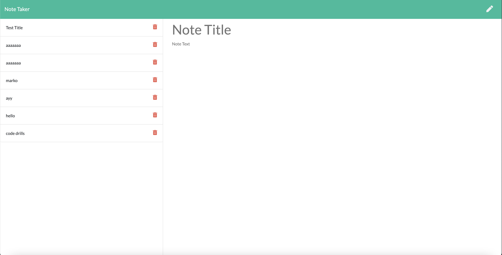

# Note Taker

## App Picture


## Summary
This app was created to store a users notes so they can keep track of things to remember or things to do.  Utilizing express and heroku, the app collects user input and stores it in the database, sending it back to be shown on the screen.

## Install
Install all necessary packages to run app
```
npm install express 
```
```
npm install uuid
```
```
npm install heroku
```
- Express is necessary for running the site and fetching/posting all data 
- uuid is necessary to assign ID's to all new notes
- Heroku is necessary to deploy the app

## Code Snippet
The function used to collect user input, push it to the stored data and return it back as a clickable note
```
app.post("/api/notes",function(req,res){
    var newNote = req.body;
    newNote.id = uuidv4();
    fs.readFile('./db/db.json',function(err,data){
        if(err)throw(err);
        var allNotes = JSON.parse(data);
        allNotes.push(newNote);
        fs.writeFile('./db/db.json',JSON.stringify(allNotes),function(err,data){
            if(err)throw(err);
            console.log('Note Saved!');
            res.json(newNote);
        });
    });
});
```

## Technologies Used
- JavaScript - Used to run all the necessary proccesses for the page to function such as adding notes, button usage, and saving notes
- HTML - Used to create the general framework of the page
- CSS - Used to give the page its clean aesthetic
- Heroku - Used to deploy the site for public usage
- Express - Used to connect the front end and back end to give the site full functionality
- UUID - Used to assign ID's to each note added so that they can be organized, listed, and clicked on
- Node.js - Used to run application from command line

## Author Links
- [LinkedIn] (https://www.linkedin.com/in/marko-sanchez-800)
- [GitHub] (https://github.com/markosanchez800)